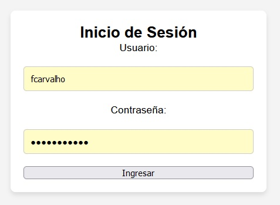

# Proyecto: APrint
Este proyecto es un sistema básico de inicio de sesión y manejo de trabajadores.

## Requisitos del Sistema:
- XAMPP o cualquier otro servidor local con soporte PHP y MySQL.
- Navegador moderno (Google Chrome, Firefox, Edge).
- PHP versión 7.4 o superior.
- MySQL versión 5.7 o superior.

## Acceder al Sistema:
1. Iniciar el servidor local:
   - Si estás utilizando XAMPP, asegúrate de que Apache y MySQL estén en ejecución.
   - Accede al proyecto desde el navegador con la URL:
     ```
     http://localhost/APrint/
     ```

2. Iniciar sesión:
   - Si es tu primer acceso y no tienes un usuario registrado, puedes crear uno desde la base de datos manualmente en la tabla `trabajador` desde phpMyAdmin.

3. Estilos y Recursos:
   - Los estilos CSS se encuentran en la carpeta `css` y el archivo principal es `estilos.css`.
   - Asegúrese de que los archivos de estilo estén correctamente referenciados.

## Errores comunes:
- Si aparece un error como "Acceso no permitido", verifique que está accediendo a la página correcta.
- Si el sistema indica "Usuario no existe", asegúrese de haber creado correctamente un usuario en la base de datos o revise el cifrado de la contraseña.

## Notas adicionales:
- Este sistema utiliza PHP para el backend y MySQL como base de datos.
- El sistema está configurado para cifrar las contraseñas utilizando MD5. Para mayor seguridad, considere utilizar un método de cifrado más fuerte como bcrypt en el futuro.

## Documentación adicional:
- Para más información sobre la estructura del proyecto o cómo agregar nuevas funcionalidades, consulte la carpeta `/docs` o contacte al desarrollador.

## Capturas de pantalla:

### Formulario de inicio de sesión


### Página principal con bienvenida


